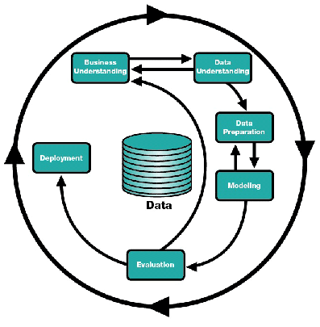

```{r setup, include=FALSE}
knitr::opts_knit$set(root.dir = getwd())
```

# Introdução

O presente trabalho tem por finalidade entender e correlacionar dados que possam algum significado mais profundo do que aparentam ter, assim com os dados da pós-graduação em engenharia biomédica em mãos busca-se encontrar principais fatores, professores mais envolvidos, temas mais relevantes e afins.

#Metodologia

Para um melhor resultado do trabalho buscou-se seguir e adaptar-se a metodologia CRISP-DM, para isso baseou-se no ciclo de projeto usado pelo CRISP-DM.

O ciclo é basicamente definido pelas seguintes fases:

* **Entendimento do negócio** : primeiramente deve-se entender o que se busca encontrar, haja visto que não faz sentido fazer uma análise de dados sem saber o que se busca.

* **Entendimento dos dados** : Busca-se entender os dados de forma mais superficial primeiramente.

* **Preparação de dados ** : Então limpa-se o dado e prepara o dado para que se possa facilitar seu processamento.

* **Modelagem ** : Faz a modelagem do dado.
* **Avaliação ** : Avalia-se o resultado da modelagem.
* **Implantação ** : Faz uso dos dados.

As fases não são independentes entre si, mas possuem certa comunicação, depedendo das fases, além de não ser estritamente sequencial, sendo melhor visualizado na figura abaixo.



Por esta imagem consegue-se perceber que o entendimento do negócio e do dado pode muitas vezes ser alternada, indo e voltando.

## Delimitações iniciais


###Domínio de Aplicação do projeto
O domínio de aplicação do projeto é  produção científica ou produção acadêmica de um subgrupo de pesquisadores vinculados à Universidade de Brasília, sendo vinculado ao subtema __engenharia biomédica__, tais arquivos foram pegos na plataforma elattes.

###Problema abordado

Problema abordado tem por finalidade obter dados de forma descritiva, quantitativa e de modelagem computacional ou estatástica, que permitam caracterizar como, porque e também para que ocorre a produção científica e acadêmica na Área de engenharia biomédica.

# CRISP-DM Fase 1 - Entendimento do Negócio

A Universidade de Brasília é uma das grandes universidades federais, sendo responsável pela produção de artigos visando artigos acadêmicos, este presente trabalho de como programas :

## Programas de Pós-Graduação Grupo 15
| Ids           | Área de Avaliação | Nome do Programa                                  | Link Capes                                                        | ME | DO | MP |
|---------------|------------------:|---------------------------------------------------|-------------------------------------------------------------------|----|----|----|
| 53001010059P8 |    ENGENHARIAS IV | ENGENHARIA ELÉTRICA                               | [ENGENHARIA ELÉTRICA (53001010059P8)](https://sucupira.capes.gov.br/sucupira/public/consultas/coleta/programa/viewPrograma.jsf?popup=true&&cd_programa=53001010059P8)                               | -  | -  | 3  |
| 53001010080P7 |    ENGENHARIAS IV | ENGENHARIA ELÉTRICA                               | [ENGENHARIA ELÉTRICA (53001010080P7)](https://sucupira.capes.gov.br/sucupira/public/consultas/coleta/programa/viewPrograma.jsf?popup=true&&cd_programa=53001010080P7)                               | 4  | 4  | -  |
| 53001010081P3 |    ENGENHARIAS IV | ENGENHARIA DE SISTEMAS ELETRÔNICOS E DE AUTOMAÇÃO | [ENGENHARIA DE SISTEMAS ELETRÔNICOS E DE AUTOMAÇÃO (53001010081P3)](https://sucupira.capes.gov.br/sucupira/public/consultas/coleta/programa/viewPrograma.jsf?popup=true&&cd_programa=53001010081P3) | 4  | 4  | -  |
| 53001010083P6 |    ENGENHARIAS IV | ENGENHARIA BIOMÉDICA                              | [ENGENHARIA BIOMÉDICA (53001010083P6)](https://sucupira.capes.gov.br/sucupira/public/consultas/coleta/programa/viewPrograma.jsf?popup=true&&cd_programa=53001010083P6)                              | 3  | -  | -  |

Sendo o enfoque principal os dados referente a engenharia biomédica, que por sua vez tem sua pesquisa muitas voltada a novas soluções na área de biomédica.

##Avaliação das Circunstancias

Este trabalho terá o limite que os próprios dados gerado pela plataforma elattes tem, já que se os dados fornecidos delimitariam o escopo do projeto e até pode-se ir, ou melhor, até onde os dados permitem uma análise fidedgina. 

#CRISP-DM Fase 2 - Entendimento dos Dados

##CRISP-DM Fase.Atividade 2.1 - Coleta inicial dos dados

Todos os arquivos com dados iniciais a seguir apresentados foram fornecidos pelos professores responsáveis pela disciplina, através da plataforma elattes. Os dados foram gerados no mês de setembro de 2018, data em que o presente grupo começou a realizar o trabalho e compilam informações entre os anos de 2010 e 2017, das áreas expostas na seção anterior. 
Os arquivos estão no formato JSON, sendo todos fornecidos pelos docentes responsável por esta disciplina.

###Perfil profissional dos docentes vinculados às pós-graduações

```{r}
json.perfil <- "dados-2018-2/engenharia-biomedica/279.profile.json"
file.info(json.perfil)
```

O arquivo `r json.perfil` apresenta dados sobre o perfil de todos os docentes vinculados a programas de pós-graduação, em engenharia biomédia, da UnB, entre 2010 e 2017. 


###Orientações de mestrado e doutorado realizadas pelos docentes vinculados às pós-graduações

```{r}
json.advise <- "dados-2018-2/engenharia-biomedica/279.advise.json"
file.info(json.advise)
```

O arquivo `r json.advise` apresenta dados sobre o orientações de mestrado e doutorado feitas por todos os docentes vinculados a programas de pós-graduação em engenharia biomédica, da UnB, entre 2010 e 2017. 


###Produção bibliográfica gerada pelos docentes vinculados às pós-graduações

```{r}
json.producao.bibliografica <- "dados-2018-2/engenharia-biomedica/279.publication.json"
file.info(json.producao.bibliografica) 
```

O arquivo `r json.producao.bibliografica` apresenta dados sobre a produção bibliográfica gerada por todos os docentes vinculados a programas de pós-graduação, em engenharia biomédica, da UnB, entre 2010 e 2017. 

###ID's dos docentes participantes e o que contêm o arquivo list.json

```{r}
json.list <- "dados-2018-2/engenharia-biomedica/279.list.json"
file.info(json.list) 
```

O arquivo `r json.list` apresenta o id de todos docentes vinculados a programas de pós-graduação, em engenharia biomédica, da UnB, entre 2010 e 2017.Porém tal arquivo se mostra inútil, haja visto que só contém o id e que as outras variáveis como __"nome"__ sempre tem seu valor igual a __""__. 


###Redes de colaboração entre docentes

```{r}
json.graph<-'dados-2018-2/engenharia-biomedica/279.graph.json'
file.info(json.graph)
```

O arquivo `r json.graph` apresenta redes de colaboração na co-autoria de artigos científicos, feitas entre os docentes vinculados a programas de pós-graduação da UnB, entre 2010 e 2017.

##CRISP-DM Fase.Atividade 2.2 - Descrição dos Dados

Para ler e manipular inicialmente esses dados, serão usadas primordialmente as bibliotecas seguintes 

```{r library-load}
library(jsonlite)
library(listviewer)
library(readxl)
library(readr)
library(readtext)
library(ggplot2)
library(tidyverse)
library(stringr)
```

Com estas bibliotecas seremos capazes de responder e determinar qual o volume de dados, a estrutura dos dados (tipos), codificações usadas, etc..

###Descrição dos dados do perfil

```{r}
unb.prof <- fromJSON("dados-2018-2/engenharia-biomedica/279.profile.json")
```

A quantidade de docentes sob análise é apresentada a seguir.
```{r}
length(unb.prof)
```

Para um melhor entendimento é importante saber como os dados estão dispostos para algum número de ocorrência.

```{r}
### Usando glimpse
glimpse(unb.prof[[1]], width = 30)
```

Podemos inferir que:

* Que o professor não é da área da engenharia elétrica, por formação, mas acabou por aderir a subárea engenharia biomédica.
* Não é nativo da UnB, sendo formado no UFG.
* Atualmente trabalha na UnB do Gama.
* Sua senioridade é de 9.

####Potencial de utilização dos dados do perfil dos docentes

###Descrição dos dados de orientações

```{r}
unb.adv <- fromJSON("dados-2018-2/engenharia-biomedica/279.advise.json")
# Mostrando as listas presentes neste arquivo.
names(unb.adv)
# Explorando um nível de detalhe de Orientações de doutorados concluídas
names(unb.adv$ORIENTACAO_CONCLUIDA_DOUTORADO)
############## DOUTORADO 2017
#Buscando cursos que mais produziram doutorados.
head(sort(table(unb.adv$ORIENTACAO_CONCLUIDA_DOUTORADO$`2017`$curso), decreasing = TRUE), 10)
#Sabendo suas instituições
head(sort(table(unb.adv$ORIENTACAO_CONCLUIDA_DOUTORADO$`2017`$instituicao), decreasing = TRUE), 10)
#Sabendo seus orientadores
data_orienM <- capture.output(str(unb.adv$ORIENTACAO_CONCLUIDA_DOUTORADO$`2017`$nome_orientadores))
unique(data_orienM)
############## MESTRADO 2017
#Buscando cursos que mais produziram mestrados.
head(sort(table(unb.adv$ORIENTACAO_CONCLUIDA_MESTRADO$`2017`$curso), decreasing = TRUE), 10)
head(sort(table(unb.adv$ORIENTACAO_CONCLUIDA_MESTRADO$`2017`$instituicao), decreasing = TRUE), 10)
#Sabendo suas instituições
head(sort(table(unb.adv$ORIENTACAO_CONCLUIDA_MESTRADO$`2017`$instituicao), decreasing = TRUE), 10)
#Sabendo seus orientadores
data_orien <- capture.output(str(unb.adv$ORIENTACAO_CONCLUIDA_MESTRADO$`2017`$nome_orientadores))
unique(data_orien)
```

Como se pode perceber apenas u, professor que orientou doutorado concluido em 2017 ( "Marilia Miranda Forte Gomes") também fez parte dos professores que orientaram no mestrado: 

* "Georges Daniel Amvame Nze"
* "Jose Felicio da Silva"
* "Lourdes Mattos Brasil"
* "Marcelino Monteiro de Andrade"
* "Marilia Miranda Forte Gomes"
* "Ronni Geraldo Gomes de Amorim"

Sendo o professor "Marcus Vinícius Chaffim Costa" responsável apenas por orientação de doutorado em 2017.

###Descrição dos dados list.json

```{r}
unb.list <- fromJSON("dados-2018-2/engenharia-biomedica/279.list.json")
#analisando a quantidade de elementos presente em list.json
length(unb.list$fiocruz$id)
# Mostrando alguns id, verificar que eles são diferentes       
d_listID <- unb.list$fiocruz$id
unique(d_listID)
#Mostrando nome sempre igual ""
d_listNO <- unb.list$fiocruz$nome
unique(d_listNO)
#Mostrando periodo sempre igual 2010-2017 
d_listDT <- unb.list$fiocruz$periodo
unique(d_listDT)


```

Feito a análise, percebe-se que apenas o campo id que muda, tanto __"nome"__ (obtendo sempre o valor "") e __"periodo"__(obtendo sempre o valor["2010","2017"]), por isso considera-se este arquivo JSON como inútil, haja visto que não dá para obter quaisquer dado plaúsivel, somente os id.


###Descrição dos dados de produção bibliográfica
```{r}
unb.pub <- fromJSON("dados-2018-2/engenharia-biomedica/279.publication.json")
# Verificando os tipos de produções que existe.
names(unb.pub)
#Analisando o qual tipo de informação se tem em periódicos no ano 2012.
names(unb.pub$PERIODICO$`2012`)
#Nomes dos periódicos em que tiveram mais publicações na área de engenharia biomédica.
head(sort(table(unb.pub$PERIODICO$`2017`$periodico), decreasing = TRUE), 10)
#Nomes dos periódicos em que tiveram mais publicações de artigos aceitos na área de engenharia biomédica da UnB no 2017.
head(sort(table(unb.pub$ARTIGO_ACEITO$`2017`$periodico), decreasing = TRUE), 10)
#Nomes dos autores que produziram um tipo de produção que não estava contemplada .
head(sort(table(unb.pub$DEMAIS_TIPOS_DE_PRODUCAO_BIBLIOGRAFICA$`2011`$autores), decreasing = TRUE), 10)

```


###Descrição dos dados de redes de colaboração

```{r}
unb.graph <- fromJSON("dados-2018-2/engenharia-biomedica/279.graph.json")
# Suas variáveis
names(unb.graph)
# Quantidade de nós
length(unb.graph$nodes$id)
# Quantidade de links de fonte 
length(unb.graph$links$source)
# Quantidade de links de chegada 
length(unb.graph$links$target)
#exemplos de pesos da aresta
str(unb.graph$links$weigth)
```


##CRISP-DM Fase.Atividade 2.3 - Análise exploratória dos dados

###Arquivo Profile

```{r}
# Total de áreas de atuação de todos profissionais
sum(sapply(unb.prof, function(x) nrow(x$areas_de_atuacao)))
# Número de pessoas por grande area
table(unlist(sapply(unb.prof, function(x) (x$areas_de_atuacao$grande_area))))
# Número de pessoas que produziram os tipos de produção específico
table(unlist(sapply(unb.prof, function(x) names(x$producao_bibiografica))))
# Número de publicações por tipo
#####ARTIGO ACEITO###############
sum(sapply(unb.prof, function(x) length(x$producao_bibiografica$ARTIGO_ACEITO$ano)))
# Número de pessoas por quantitativo de produções por pessoa 0 = 1; 1 = 2...
table(unlist(sapply(unb.prof, function(x) length(x$producao_bibiografica$ARTIGO_ACEITO$ano))))

#####CAPITULO DE LIVRO###############
sum(sapply(unb.prof, function(x) length(x$producao_bibiografica$CAPITULO_DE_LIVRO$ano)))
# Número de pessoas por quantitativo de produções por pessoa 0 = 1; 1 = 2...
table(unlist(sapply(unb.prof, function(x) length(x$producao_bibiografica$CAPITULO_DE_LIVRO$ano))))

#####LIVRO###############
sum(sapply(unb.prof, function(x) length(x$producao_bibiografica$LIVRO$ano)))
# Número de pessoas por quantitativo de produções por pessoa 0 = 1; 1 = 2...
table(unlist(sapply(unb.prof, function(x) length(x$producao_bibiografica$LIVRO$ano))))

#####PERIÓDICO###############
sum(sapply(unb.prof, function(x) length(x$producao_bibiografica$PERIODICO$ano)))
# Número de pessoas por quantitativo de produções por pessoa 0 = 1; 1 = 2...
table(unlist(sapply(unb.prof, function(x) length(x$producao_bibiografica$PERIODICO$ano))))

#####TEXTO EM JORNAIS###############
sum(sapply(unb.prof, function(x) length(x$producao_bibiografica$TEXTO_EM_JORNAIS$ano)))
# Número de pessoas por quantitativo de produções por pessoa 0 = 1; 1 = 2...
table(unlist(sapply(unb.prof, function(x) length(x$producao_bibiografica$TEXTO_EM_JORNAIS$ano))))

#####DEMAIS TIPOS###############
sum(sapply(unb.prof, function(x) length(x$producao_bibiografica$DEMAIS_TIPOS_DE_PRODUCAO_BIBLIOGRAFICA$ano)))
# Número de pessoas por quantitativo de produções por pessoa 0 = 1; 1 = 2...
table(unlist(sapply(unb.prof, function(x) length(x$producao_bibiografica$DEMAIS_TIPOS_DE_PRODUCAO$ano))))


# Número de produções por ano
table(unlist(sapply(unb.prof, function(x) (x$producao_bibiografica$ARTIGO_ACEITO$ano))))
table(unlist(sapply(unb.prof, function(x) (x$producao_bibiografica$CAPITULO_DE_LIVRO$ano))))
table(unlist(sapply(unb.prof, function(x) (x$producao_bibiografica$LIVRO$ano))))
table(unlist(sapply(unb.prof, function(x) (x$producao_bibiografica$PERIODICO$ano))))
table(unlist(sapply(unb.prof, function(x) (x$producao_bibiografica$TEXTO_EM_JORNAIS$ano))))
# Número de pessoas que realizaram diferentes tipos de orientações
length(unlist(sapply(unb.prof, function(x) names(x$orientacoes_academicas))))
# Número de pessoas por tipo de orientação
table(unlist(sapply(unb.prof, function(x) names(x$orientacoes_academicas))))
#Número de orientações concluidas
sum(sapply(unb.prof, function(x) length(x$orientacoes_academicas$ORIENTACAO_CONCLUIDA_MESTRADO$ano)))
sum(sapply(unb.prof, function(x) length(x$orientacoes_academicas$ORIENTACAO_CONCLUIDA_DOUTORADO$ano)))
sum(sapply(unb.prof, function(x) length(x$orientacoes_academicas$ORIENTACAO_CONCLUIDA_POS_DOUTORADO$ano)))

# Número de pessoas por quantitativo de orientações por pessoa 0 = 1; 1 = 2...
table(unlist(sapply(unb.prof, function(x) length(x$orientacoes_academicas$ORIENTACAO_CONCLUIDA_MESTRADO$ano))))
table(unlist(sapply(unb.prof, function(x) length(x$orientacoes_academicas$ORIENTACAO_CONCLUIDA_DOUTORADO$ano))))
table(unlist(sapply(unb.prof, function(x) length(x$orientacoes_academicas$ORIENTACAO_CONCLUIDA_POS_DOUTORADO$ano))))

# Número de orientações por ano
table(unlist(sapply(unb.prof, function(x) (x$orientacoes_academicas$ORIENTACAO_CONCLUIDA_MESTRADO$ano))))
table(unlist(sapply(unb.prof, function(x) (x$orientacoes_academicas$ORIENTACAO_CONCLUIDA_DOUTORADO$ano))))
table(unlist(sapply(unb.prof, function(x) (x$orientacoes_academicas$ORIENTACAO_CONCLUIDA_POS_DOUTORADO$ano))))

```

###Arquivo Publicação
```{r}

#Criando um data-frame com todos os anos
unb.pub.df <- data.frame()
for (i in 1:length(unb.pub[[1]]))
  unb.pub.df <- rbind(unb.pub.df, unb.pub$PERIODICO[[i]])
glimpse(unb.pub.df)
# Limpando o data-frame de listas
unb.pub.df$autores <- gsub("\",\"|\", \"", "; ", unb.pub.df$autores)
unb.pub.df$autores <- gsub("\"|c\\(|\\)", "", unb.pub.df$autores)
unb.pub.df$`autores-endogeno` <- gsub(",", ";", unb.pub.df$`autores-endogeno`)
unb.pub.df$`autores-endogeno` <- gsub("\"|c\\(|\\)", "", unb.pub.df$`autores-endogeno`)
glimpse(unb.pub.df)

```

###Arquivo Orientação
```{r}
#Orientação
#Visualizar a estrutura do json no painel Viewer
#jsonedit(unb.adv)
#Reunir todos os anos e orientações concluidas em um mesmo data-frame
unb.adv.tipo.df <- data.frame(); unb.adv.df <- data.frame()
for (i in 1:length(unb.adv[[1]]))
  unb.adv.tipo.df <- rbind(unb.adv.tipo.df, unb.adv$ORIENTACAO_CONCLUIDA_POS_DOUTORADO[[i]])
unb.adv.df <- rbind(unb.adv.df, unb.adv.tipo.df); unb.adv.tipo.df <- data.frame()
for (i in 1:length(unb.adv[[1]]))
  unb.adv.tipo.df <- rbind(unb.adv.tipo.df, unb.adv$ORIENTACAO_CONCLUIDA_DOUTORADO[[i]])
unb.adv.df <- rbind(unb.adv.df, unb.adv.tipo.df); unb.adv.tipo.df <- data.frame()
for (i in 1:length(unb.adv[[1]]))
  unb.adv.tipo.df <- rbind(unb.adv.tipo.df, unb.adv$ORIENTACAO_CONCLUIDA_MESTRADO[[i]])
unb.adv.df <- rbind(unb.adv.df, unb.adv.tipo.df)
glimpse(unb.adv.df)
#Transformar as colunas de listas em caracteres eliminando c("")
unb.adv.df$nome_orientadores <- gsub("\"|c\\(|\\)", "", unb.adv.df$nome_orientadores)
unb.adv.df$id_lattes_orientadores <- gsub("\"|c\\(|\\)", "", unb.adv.df$id_lattes_orientadores)
#Separar as colunas com dois orientadores
unb.adv.df <- separate(unb.adv.df, nome_orientadores, into = c("ori1", "ori2"), sep = ",")
unb.adv.df <- separate(unb.adv.df, id_lattes_orientadores, into = c("idLattes1", "idLattes2"), sep = ",")
#Numero de orientacoes por ano
table(unb.adv.df$ano)
#Tabela com nome de professor e numero de orientacoes
head(sort(table(rbind(unb.adv.df$ori1, unb.adv.df$ori2)), decreasing = TRUE), 20)
```


##CRISP-DM Fase.Atividade 2.4 - Verificação da qualidade dos dados. 

Como já informado, a verificação da qualidade dos dados envolve responder se os dados disponìveis estão realmente completos. 

As informações disponìveis são suficientes para o trabalho proposto? 

Neste projeto, a verificação da qualidade dos dados é responsabilidade dos alunos.

#CRISP-DM Fase 3 -  __Preparação dos Dados__

Como já informado, na fase de __Preparação dos Dados__ os _datasets_ que serão utilizados em todo o trabalho são construìdos a partir dos dados brutos. Aqui os dados são “filtradosâ€� retirando-se partes que não interessam e selecionando-se os “camposâ€� necessários para o trabalho de mineração. 

São 5 as atividades genéricas nesta fase de preparação dos dados, a seguir divididas em subseções

##CRISP-DM Fase.Atividade 3.1 - Seleção dos dados. 

Como já informado, a seleção dos dados envolve identificar quais dados, da nossa "montanha de dados", serão realmente utilizados. 

Quais variáveis dos dados brutos serão convertidas para o _dataset_? 

Não é raro cometer o erro de selecionar dados para um modelo preditivo com base em uma falsa ideia de que aqueles dados contém a resposta para o modelo que se quer construir. Surge o cuidado de se separar o sinal do ruìdo (Silver, Nate. The Signal and the Noise: Why so many predictions fail — but some don’t. USA: The Penguin Press HC, 2012.). 

##CRISP-DM Fase.Atividade 3.2 - Limpeza dos dados

##CRISP-DM Fase.Atividade 3.3 - Construção dos dados

Como já informado, a construção dos dados envolve a criação de novas variáveis a partir de outras presentes nos _datasets_.
```{r}
# Funcoes 

# converte as colunas de um dataframe tipo lista em tipo character
cv_tplista2tpchar <- function( df  ) { 
  for( variavel in names(df)) {
    if (class(df[[variavel]]) == "list" ) {
      df[[variavel]] <- lapply(df[[variavel]] ,   function(x)   lista2texto( x  ) ) 
      df[[variavel]] <- as.character( df[[variavel]] )
    }
  }
  return(df)
}
###


# converte o conteudo de lista em array de characters
lista2texto <- function( lista  ) {
  if(is.null(lista)) {
    return ( NULL )
  }
  saida <- ""
  for( j in 1:length(lista)) { 
    for( i in 1:length(lista[[j]]) ) {
      elemento <- lista[[j]][i] 
      if( !is.null(elemento)) { 
        if( i == length(lista[[j]]) & j == length(lista)  ) { 
          # se for o ultimo elemento nao coloque o ponto e virgula no final            
          saida <- paste0( saida , elemento  )
        } else {
          # enquanto nao for o ultimo coloque ; separando os elementos concatenados 
          saida <- paste0( saida , elemento , sep = " ; ")
        }
      }  
    }
  }
  return( saida )
}

# Converte producao elattes separada por anos em um unico dataframe 
converte_producao2dataframe<- function( lista_producao ) {
  df_saida <- NULL 
  
  for( ano in names(lista_producao)) {
    df_saida <- rbind(df_saida , lista_producao[[ano]])
  }
  
  # converte tipo lista em array de character 
  df_saida <- cv_tplista2tpchar(df_saida)
  return(df_saida)
  

}

#concatena dois dataframes com  colunas diferentes 
concatenadf <- function( df1, df2) { 
  #cria colunas de df1 que faltam em df2
  for( coluna in names(df1 ) ) {
    if( !is.element(coluna, names(df2) )) {
      df2[coluna] <- NA
    }
  }
  
  #cria colunas de df2 que faltam em df1  
  for( coluna in names(df2 ) ) {
    
    if( !is.element(coluna, names(df1) )) {
      df1[coluna] <- NA
    }
  }
  
  
  #faz o rbind dos dois dataframes 
  df_final <- rbind(df1 , df2)
  return(df_final)
  
}

# Extracao dos perfis dos professores 

extrai_1perfil <- function( professor ) {
  idLattes <- names(professor)
  nome <- professor[[idLattes]]$nome   
  resumo_cv <- professor[[idLattes]]$resumo_cv 
  endereco_profissional <- professor[[idLattes]]$endereco_profissional #list 
  instituicao <- endereco_profissional$instituicao
  orgao <- endereco_profissional$orgao
  unidade <- endereco_profissional$unidade
  DDD <- endereco_profissional$DDD
  telefone <- endereco_profissional$telefone
  bairro <- endereco_profissional$bairro
  cep <- endereco_profissional$cep
  cidade <- endereco_profissional$cidade
  senioridade <- professor[[idLattes]]$senioridade  
  df_1perfil <- data.frame( idLattes , nome, resumo_cv ,instituicao , 
                           orgao, unidade , DDD, telefone, bairro,cep,cidade , senioridade,
                           stringsAsFactors = FALSE)
  
  return(df_1perfil)  
}

extrai_perfis <- function(jsonProfessores) {
  df_saida <- data.frame()
  for( i in 1:length(jsonProfessores)) {
    jsonProfessor <- jsonProfessores[i]
    df_professor <- extrai_1perfil(jsonProfessor)
    if( nrow(df_saida) > 0 ) {
      df_saida <- rbind(df_saida , df_professor)
    } else {
      df_saida <- df_professor 
    }
  }
   
  return(df_saida)
}

# Extracao da producao bibliografica dos professores 

extrai_1producao <- function(professor) {
  idLattes <- names(professor)
  df_1producao <<- NULL 
  producao_bibliografica <- professor[[idLattes]]$producao_bibiografica  #list
  for( tipo_producao in names(producao_bibliografica)) { 
    df_temporario <- cv_tplista2tpchar ( producao_bibliografica[[tipo_producao]]) 
    df_temporario$tipo_producao <-  tipo_producao 
    df_temporario$idLattes <-  idLattes
    df_1producao <- concatenadf( df_1producao , df_temporario  )
  }  
  return(df_1producao)
}

extrai_producoes <- function( jsonProfessores) {
  df_saida <- data.frame()
  for( i in 1:length(jsonProfessores)) {
    jsonProfessor <- jsonProfessores[i]
    df_producao <- extrai_1producao(jsonProfessor)
    if( nrow(df_saida) > 0 ) {
      df_saida <- concatenadf(df_saida , df_producao)
    } else {
      df_saida <- df_producao 
    }
  }
  df_saida <- df_saida %>% filter( !is.na(tipo_producao))
  return(df_saida)  
}

# Extracao das orientacoes dos professores 

extrai_1orientacao <- function(professor) {
  idLattes <- names(professor)
  df_1orientacao <- NULL
  orientacoes_academicas  <- professor[[idLattes]]$orientacoes_academicas  #list
  for( orientacao in names(orientacoes_academicas )) { 
    df_temporario <- cv_tplista2tpchar ( orientacoes_academicas[[orientacao]])
    df_temporario$orientacao <-  orientacao 
    df_temporario$idLattes <-  idLattes
    df_1orientacao <- concatenadf( df_1orientacao , df_temporario  )
  }  
  return(df_1orientacao) 
}

extrai_orientacoes <- function(jsonProfessores) {
  df_saida <- data.frame()
  for( i in 1:length(jsonProfessores)) {
    jsonProfessor <- jsonProfessores[i]
    df_orientacao <- extrai_1orientacao(jsonProfessor)
    if( nrow(df_saida) > 0 ) {
      df_saida <- concatenadf(df_saida , df_orientacao)
    } else {
      df_saida <- df_orientacao
    }
  }
  df_saida <- df_saida %>% filter(!is.na(idLattes))
  return(df_saida)  
}

# Extracao das areas de atuacao dos professores 

extrai_1area_de_atuacao <- function(professor){
  idLattes <- names(professor)
  df_1area <-  professor[[idLattes]]$areas_de_atuacao
  df_1area$idLattes <- idLattes
  return(df_1area)
}

extrai_areas_atuacao <- function(jsonProfessores){
  df_saida <- data.frame()
  for( i in 1:length(jsonProfessores)) {
    jsonProfessor <- jsonProfessores[i]
    df_area_atuacao <- extrai_1area_de_atuacao(jsonProfessor)
    if( nrow(df_saida) > 0 ) {
      df_saida <- concatenadf(df_saida , df_area_atuacao)
    } else {
      df_saida <- df_area_atuacao
    }
  }
  df_saida <- df_saida %>% filter( !is.na(idLattes))
  return(df_saida)   
}
########################### Inicio 

# colocar o diretorio onde está o arquivo json de perfis a serem lidos 
unb.prof.json <- read_file("dados-2018-2/engenharia-biomedica/279.profile.json")
unb.prof.df.capes <- read.csv("dados-2018-2/PesqPosCapes.csv", 
                              sep = ";", header = TRUE, colClasses = "character")
unb.prof <- fromJSON(unb.prof.json)
length(unb.prof)

# extrai perfis dos professores 
unb.prof.df.professores <- extrai_perfis(unb.prof)

# extrai producao bibliografica de todos os professores 
unb.prof.df.publicacoes <- extrai_producoes(unb.prof)

#extrai orientacoes 
unb.prof.df.orientacoes <- extrai_orientacoes(unb.prof)

#extrai areas de atuacao 
unb.prof.df.areas.de.atuacao <- extrai_areas_atuacao(unb.prof)

#salva os daframes 
save(unb.prof.df.professores, unb.prof.df.publicacoes,
     unb.prof.df.orientacoes, unb.prof.df.areas.de.atuacao, file = "dataframes.Rda")

#cria arquivo para análise
unb.prof.df <- data.frame()
unb.prof.df <- unb.prof.df.professores %>% 
  select(idLattes, nome, resumo_cv, senioridade) %>% 
  left_join(
    unb.prof.df.orientacoes %>% 
      select(orientacao, idLattes) %>% 
      filter(!grepl("EM_ANDAMENTO", orientacao)) %>% 
      group_by(idLattes) %>% 
      count(orientacao) %>% 
      spread(key = orientacao, value = n), 
    by = "idLattes") %>% 
  left_join(
    unb.prof.df.publicacoes %>% 
      select(tipo_producao, idLattes) %>% 
      filter(!grepl("ARTIGO_ACEITO", tipo_producao)) %>% 
      group_by(idLattes) %>% 
      count(tipo_producao) %>% 
      spread(key = tipo_producao, value = n), 
    by = "idLattes") %>% 
  left_join(
    unb.prof.df.areas.de.atuacao %>% 
      select(area, idLattes) %>% 
      group_by(idLattes) %>% 
      summarise(n_distinct(area)), 
    by = "idLattes") %>% 
  left_join(
    unb.prof.df.capes %>% 
      select(AreaPos, idLattes) %>% 
      group_by(idLattes) %>% 
      summarise(n_distinct(AreaPos)), 
    by = "idLattes")

glimpse(unb.prof.df)
```


##CRISP-DM Fase.Atividade 3.4 - Integração dos dados

Como já informado, a integração dos dados envolve a união (merge) de diferentes tabelas para criar um único _dataset_ para ser utilizado no R, por exemplo.

##CRISP-DM Fase.Atividade 3.5 -  Formatação dos dados

Como já informado, a formatação de dados envolve a realização de pequenas alterações na estrutura dos dados, como a ordem das variáveis, para permitir a execução de determinado método de data mining.

#CRISP-DM Fase 4 - __Modelagem__

Como já informado, na fase de __Modelagem__ no CRISP-DM ocorre a construção e avaliação de modelos estatìsticos ou computacionais, podendo ser realizada em quatro atividades genéricas, a seguir organizadas na forma de seções

##CRISP-DM Fase.Atividade 4.1 - Seleção das técnicas de modelagem

##CRISP-DM Fase.Atividade 4.2 -  Realização de testes de modelagem

Como já informado, na realização de testes de modelagem diferentes modelos estatìsticos ou computacionais são previamente testados e avaliados. Pode-se dividir o _dataset_ criado na etapa anterior para se ter uma base de treino na construção de modelos, e outra pequena parte para validar  e avaliar a eficiência de cada modelo criado até se chegar ao mais “eficienteâ€�. 

##CRISP-DM Fase.Atividade 4.3 -  Construção do modelo definitivo

Como já informado, a construçao do modelo definitivo é realizada com base na melhor experiência do passo anterior.

##CRISP-DM Fase.Atividade 4.4 - Avaliação do modelo

#CRISP-DM Fase 5 - __Avaliação__

Como já informado, na fase de __Avaliação__ do CRISP-DM os resultados não são apenas avaliados, mas se verifica se existem questões relacionadas à organização que não foram suficientemente abordadas. Deve-se refletir se o uso arepetido do modelo criado pode trazer algum “efeito colateralâ€� para a organização. 

Como já informado, nesta fase, pode-se trabalhar com 3 atividades genéricas, a seguir distribuìdas em seções.

##CRISP-DM Fase.Atividade 5.1 - Avaliação dos resultados

##CRISP-DM Fase.Atividade 5.2 - Revisão do processo

Como já informado, durante a revisão do processo verifica-se se o modelo foi construìdo adequadamente. As variáveis (passadas) para construir o modelo estarão disponìveis no futuro?

##CRISP-DM Fase.Atividade 5.3 -  Determinação dos etapas seguintes

Como já informado, pode ser necessário decidir-se por finalizar o projeto, passar à etapa de desenvolvimento, ou rever algumas fases anteriores para a melhoria do projeto.

#CRISP-DM Fase 6 - __Implantação__ (_deployment_)

Como já informado, na fase de __Implantação__ (_deployment_) se realiza o planejamento de implantação dos produtos desenvolvidos (scripts, no caso do executado nesta disciplina) para o ambiente operacional, para seu uso repetitivo, envolvendo atividades de monitoramento e manutenção do sistema (script) desenvolvido. A fase de implantação concluir com a produção e apresentação do relatório final com os resultados do projeto.

Como já informado, são seis as atividades genéricas na fase de __implantação__, a seguir apresentadas na forma de seções.

##CRISP-DM Fase.Atividade 6.1 -  Planejamento da transição 

De que forma os produtos desenvolvidos pelo grupo poderiam ser colocados em uso prático regular, na organização cliente?

##CRISP-DM Fase.Atividade 6.2 -  Planejamento do monitoramento dos produtos 

De que forma seria possìvel realizar o monitoramento do funcionamento dos produtos em utilização no ambiente operacional?

##CRISP-DM Fase.Atividade 6.3 -  Planejamento de manuteção 

que manutenções, ajustes, mudanças, poderia ter que ser eventualmente realizadas no produto (scripts), quando em uso no ambiente operacional do cliente?

##CRISP-DM Fase.Atividade 6.4 -  Produção do relatório final

A entrega do relatório do grupo, tomando como base este aqui, reflete  a execução desta etapa.

##CRISP-DM Fase.Atividade 6.5 -  Apresentação do relatório final

Como já informado, não será feita apresentação do relatório, mas esperamos que publicações cientìficas possam ser geradas com pelo seu grupo, com o apoio dos professores da disciplina.

##CRISP-DM Fase.Atividade 6.6 -  Revisão sobre a execução do projeto

Deve-se fazer aqui o registro de lições aprendidas, bem como traçadas perspectivas futuras de aprimoramento deste trabalho, da disciplina de Ciência de Dados para Todos etc.

# Referências

* Azevedo, Mário Luiz Neves de, João Ferreira de Oliveira, e Afrânio Mendes Catani. “O Sistema Nacional de Pós-Graduação (SNPG) e o Plano Nacional de Educação (PNE 2014-2024): regulação, avaliação e financiamentoâ€�. Revista Brasileira de Polìtica e Administração da Educação 32, nº 3 (2016). http://dx.doi.org/10.21573/vol32n32016.68576.
* Can, Fazli, Tansel Özyer, e Faruk Polat, orgs. State of the Art Applications of Social Network Analysis. Lecture Notes in Social Networks. Switzerland: Springer International Publishing, 2014.
* CAPES. “Documentos de �rea�. CAPES.gov.br. Acessado 12 de junho de 2018. http://avaliacaoquadrienal.capes.gov.br/documentos-de-area.
* ———. “Plano Nacional de Pós-Graduação - PNPG 2011/2020 Vol. 1â€�. Brasìlia - DF, dezembro de 2010. http://www.capes.gov.br/images/stories/download/Livros-PNPG-Volume-I-Mont.pdf.
* ———. “Plano Nacional de Pós-Graduação - PNPG 2011/2020 Vol. 2â€�. Brasìlia - DF, dezembro de 2010. http://www.capes.gov.br/images/stories/download/PNPG_Miolo_V2.pdf.
* ———. “Sucupira: coleta de dados, docentes de pós-graduação stricto sensu no Brasil 2015â€�. CAPES - Banco de Metadados, 16 de março de 2016. http://metadados.capes.gov.br/index.php/catalog/63.
* Chapman, Pete, Julian Clinton, Randy Kerber, Thomas Khabaza, Thomas Reinartz, Colin Shearer, e Rüdiger Wirth. “CRISP-DM 1.0: Step-by-Step Data Mining Guide�. USA: CRISP-DM Consortium, 2000. https://www.the-modeling-agency.com/crisp-dm.pdf.
* Datacamp. “Machine Learning with R (Skill Track)�. Datacamp, 2018. https://www.datacamp.com/tracks/machine-learning.
* Fernandes, Jorge H C, e Ricardo Barros Sampaio. “DataScienceForAll�. Zotero, 13 de junho de 2018. https://www.zotero.org/groups/2197167/datascienceforall.
* ———. “Especificação do Trabalho Final da Disciplina de Ciência de Dados para Todos 2017.2: Estudo sobre a visibilidade internacional da produção cientìfica das pós-graduações vinculadas às áreas de conhecimento da CAPES, na Universidade de Brasìlia (Comunicação Interna)â€�. Disciplina 116297 - Tópicos Avançados em Computadores, turma D, do semestre 2017.2, do Departamento de Ciência da Computação do Instituto de Ciências Exatas da Universidade de Brasìlia, 28 de novembro de 2017. https://aprender.ead.unb.br/pluginfile.php/474549/mod_resource/content/1/Estudo%20da%20Cie%CC%82ncia.pdf.
* Fernandes, Jorge H C, Ricardo Barros Sampaio, e João Ribas de Moura. “Ciência de Dados para Todos (Data Science   For All) - 2018.1 - Análise da Produção Cientìfica e Acadêmica da Universidade de Brasìlia - Modelo de Relatório Final da Disciplina - Departamento de Ciência da Computação da UnBâ€�. Disciplina 116297 - Tópicos Avançados em Computadores, turma D, do semestre 2018.1, do Departamento de Ciência da Computação do Instituto de Ciências Exatas da Universidade de Brasìlia, 13 de junho de 2018.
* Frickel, Scott, e Kelly Moore. The New Political Sociology of Science: Institutions, Networks, and Power. Science and technology in society. USA: The University of Wisconsin Press, 2006.
* Graduate Prospects Ltd. “Job profile: Higher education lecturer�, 2018. https://www.prospects.ac.uk/job-profiles/higher-education-lecturer.
* Kalpazidou Schmidt, Evanthia, e Ebbe Krogh Graversen. “Persistent factors facilitating excellence in research environments�. Higher Education 75, nº 2 (1º de fevereiro de 2018): 341–63. https://doi.org/10.1007/s10734-017-0142-0.
* Kilduff, Martin, e Wenpin Tsai. Social Networks and Organizations. UK: Sage Publications, 2003.
* Kolaczyk, Eric D., e Gábor Csárdi. Statistical Analysis of Network Data with R. USA: Springer, 2014.
* Kuhn, Max, Jed Wing, Steve Weston, Andre Williams, Chris Keefer, Allan Engelhardt, Tony Cooper, et al. “Package ‘Caret’ - Classification and Regression Training�, 27 de maio de 2018. https://cran.r-project.org/web/packages/caret/caret.pdf.
* Leite, Fernando César Lima. “Considerações básicas sobre  a Avaliação do Sistema  Nacional de Pós-Graduaçãoâ€�. Comunicação Pessoal (slides). Universidade de Brasìlia, abril de 2018. https://aprender.ead.unb.br/pluginfile.php/502250/mod_resource/content/1/Considera%C3%A7%C3%B5es%20b%C3%A1sicas%20sobre%20a%20Avalia%C3%A7%C3%A3o%20do%20Sistema%20Nacional.pdf.
* Lusher, Dean, Johan Koskinen, e Garry Robins, orgs. Exponential Random Graph Models for Social Networks: Theory, methods, and applications. Structural Analysis in the Social Sciences. USA: Cambridge University Press, 2013.
* Mariscal, Gonzalo, Óscar Marbán, e Covadonga Fernández. “A survey of data mining and knowledge discovery process models and methodologiesâ€�. The Knowledge Engineering Review 25, nº 2 (2010): 137–66. https://doi.org/10.1017/S0269888910000032.
* Nery, Guilherme, Ana Paula Bragaglia, Flávia Clemente, e Suzana Barbosa. “Nem tudo parece o que é: Entenda o que é plágioâ€�. Instituto de Arte e Comunicação Social da UFF, 2009. http://www.noticias.uff.br/arquivos/cartilha-sobre-plagio-academico.pdf.
* Nooy, Wouter de, Andrej Mrvar, e Vladimir Batagelj. Exploratory Social Network Analysis with Pajek. Structural Analysis in the Social Sciences. USA: Routldge, 2005.
* Pátaro, Cristina Saitê de Oliveira, e Frank Antonio Mezzomo. “Sistema Nacional de Pós-Graduação no Brasil: estrutura, resultados e desafios para polìtica de Estado - Lìvio Amaralâ€�. Revista Educação e Linguagens 2, nº 3 (julho de 2013): 11–17.
* Schwartzman, Simon. “A Ciência da Ciênciaâ€�. Ciência Hoje 2, nº 11 (março de 1984): 54–59.
* Silver, Nate. The Signal and the Noise: Why so many predictions fail — but some don’t. USA: The Penguin Press HC, 2012.
* Vicari, Donatella, Akinori Okada, Giancarlo Ragozini, e Claus Wiehs. Analysis and Modeling of Complex Data in Behavioral and Social Sciences. Studies in Classifi cation, Data Analysis, and Knowledge Organization. Switzerland: Springer, 2014.
* Wickham, Hadley, e Garrett Grolemund. R for Data Science: Import, Tidy, Transform, Visualize, and Model Data. USA: O’Reilly, 2016.

